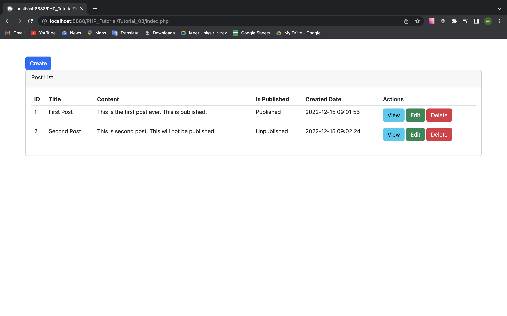
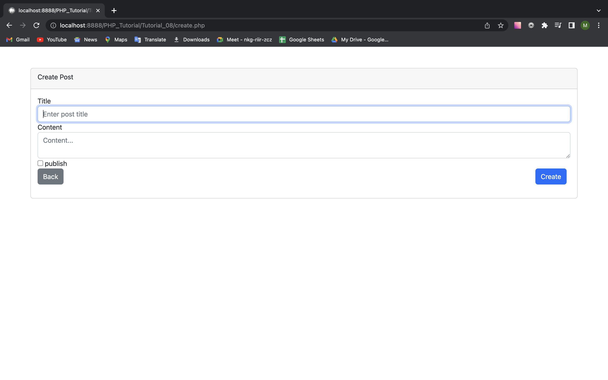
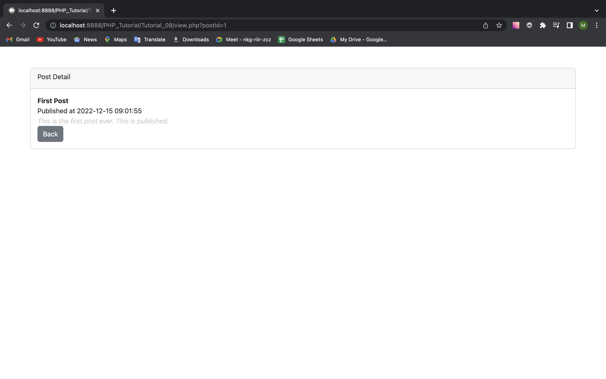
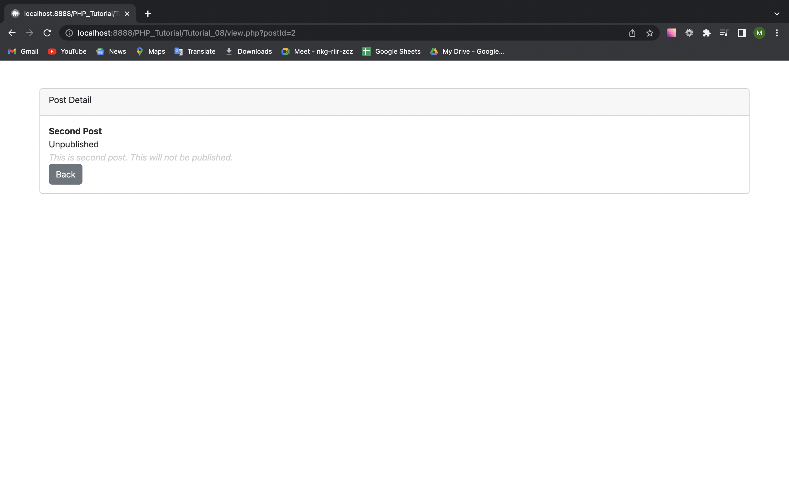
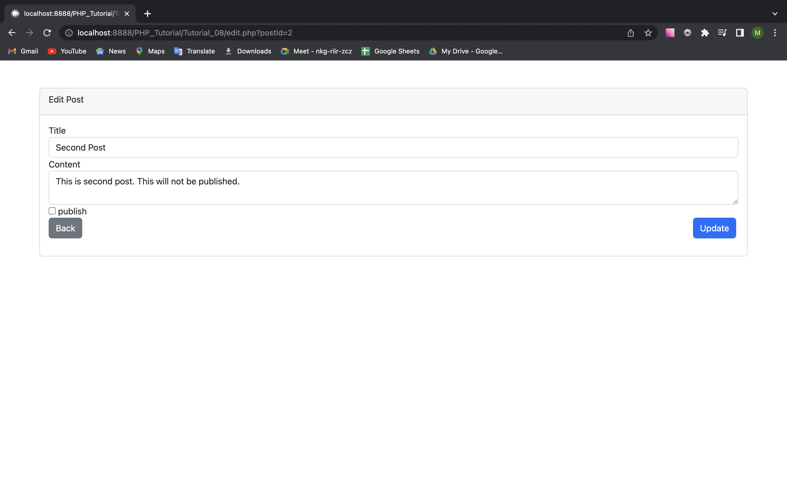
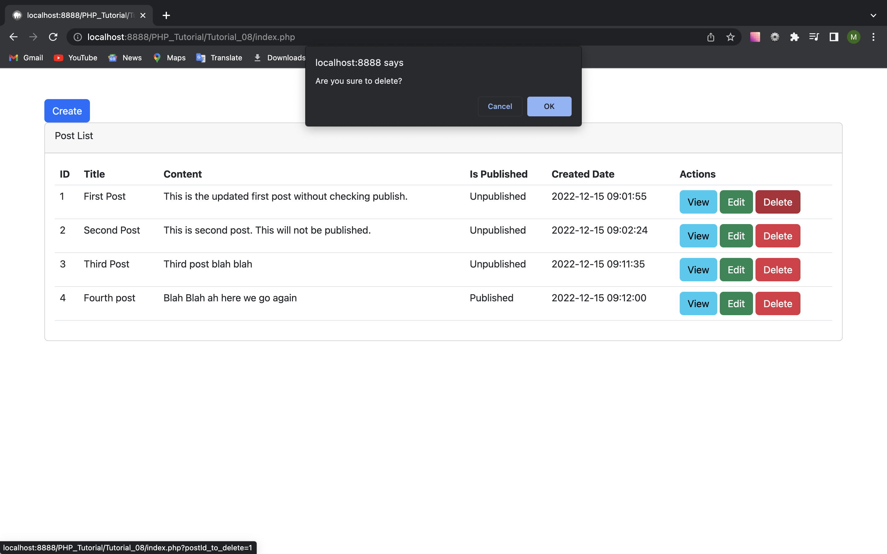

# TUTORIAL_08

<b>Preview</b>

<caption>This is Index page.</caption>

<caption>This is Create page.</caption>

<caption>This is View page (published).</caption>

<caption>This is View page (unpublished).</caption>

<caption>This is Edit page.</caption>

<caption>This is Delete layout.</caption>

